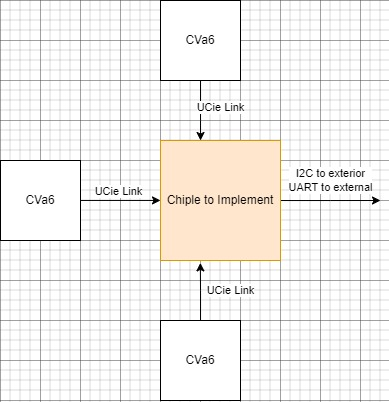

Figures
###############

Here we have some examples on how the figure directive works

.. _firstDiagram:

    This is the caption of the first diagram

As shown in :numref:`firstDiagram` this is the first diagram.

.. _apple:

.. figure:: _static/images/apple.jpg
    :scale: 100
    :align: center

    This is the caption of the apple

This is a great apple :numref:`apple` i like it.